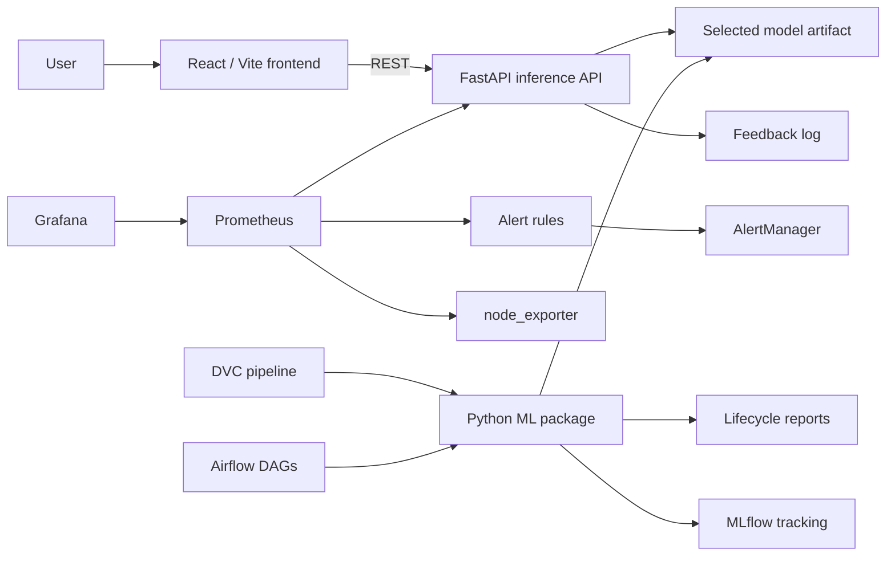

# SentinelAI

**Product Review Sentiment Analyzer for E-commerce with End-to-End MLOps**

SentinelAI is a local, end-to-end AI application that classifies e-commerce product reviews as `positive`, `neutral`, or `negative` and packages the full machine learning lifecycle around that product experience.

The project was built to demonstrate **MLOps done properly**: reproducible data pipelines, tracked experiments, acceptance-gated training, separate frontend and backend services, containerized deployment, operational orchestration, monitoring, alerting, feedback capture, and retraining readiness.

---

## What This Project Delivers

### Product experience

- a polished React/Vite frontend for non-technical users
- single-review sentiment prediction through a FastAPI backend
- confidence, class probabilities, explanation tokens, latency, and model metadata
- feedback submission when the actual sentiment becomes available
- an in-app MLOps dashboard and walkthrough for demo visibility

### MLOps experience

- automated ingestion, validation, EDA, preprocessing, feature baselines, training, evaluation, acceptance, drift checks, and report publishing
- DVC for reproducible staged pipelines and artifact versioning
- MLflow for experiment tracking, artifacts, and model packaging
- Airflow for operational DAG orchestration, retries, history, and batch workflows
- Prometheus, Grafana, AlertManager, and node exporter for observability and alerting
- Docker Compose for local environment parity
- GitHub Actions for CI/CD, image validation, and deployment smoke checks

---

## Why This Exists

E-commerce platforms receive large volumes of review text every day. Reading them manually is slow, inconsistent, and difficult to scale. SentinelAI turns that into a lightweight AI product while also exposing the entire operational lifecycle needed to run such a system responsibly.

This repository deliberately emphasizes **MLOps completeness over model novelty**. The final deployed model is a fast and explainable classical NLP pipeline, which makes it easier to train, reproduce, serve, monitor, and defend during evaluation.

---

## Current Evidence Snapshot

These values come from the current project artifacts and latest validated run state.

| Area | Current evidence |
| --- | --- |
| Dataset | `SetFit/amazon_reviews_multi_en` |
| Rows kept for project | `15,000` |
| Rows after preprocessing | `14,987` |
| Candidate models compared | `5` |
| Selected model | `tfidf_logistic_tuned` |
| Test accuracy | `0.7741` |
| Test macro F1 | `0.7737` |
| Acceptance gate | Passed |
| Model artifact size | `5.02 MB` |
| Drift score | `0.0926` |
| Maintenance action | `continue_monitoring` |
| Latest local test result | `41 passed, 1 skipped` |

---

## Architecture at a Glance



**Design principle:** the frontend and backend are independent software blocks connected only through configurable REST APIs. Training and orchestration are separate from serving, and monitoring is externalized through dedicated observability services.

---

## Technology Stack

| Layer | Choice |
| --- | --- |
| Frontend | React + Vite |
| Backend API | FastAPI |
| Model family | TF-IDF + Logistic Regression |
| Experiment tracking | MLflow |
| Reproducibility | DVC |
| Orchestration | Airflow |
| Monitoring | Prometheus + Grafana |
| Alerting | AlertManager |
| Infra telemetry | node exporter |
| Packaging | Docker Compose |
| CI/CD | GitHub Actions |

---

## Repository Structure

```text
.
├── apps/
│   ├── api/                     # FastAPI serving layer
│   └── frontend/                # React/Vite product UI
├── airflow/
│   └── dags/                    # Training, batch, and maintenance DAGs
├── docs/                        # Submission and design documents
├── infra/                       # Prometheus, Grafana, AlertManager, Docker assets
├── ml/                          # ML lifecycle modules
├── reports/                     # Generated lifecycle reports
├── models/                      # Selected model artifacts
├── tests/                       # Unit and integration tests
├── dvc.yaml                     # Reproducible pipeline DAG
├── params.yaml                  # Pipeline and training configuration
├── docker-compose.yml           # Multi-service local deployment
└── MLproject                    # Reproducible MLflow project entry points
```

---

## Main User and Operator URLs

| Surface | URL |
| --- | --- |
| Frontend | [http://localhost:5173](http://localhost:5173) |
| FastAPI | [http://localhost:8000](http://localhost:8000) |
| FastAPI docs | [http://localhost:8000/docs](http://localhost:8000/docs) |
| MLflow | [http://localhost:5001](http://localhost:5001) |
| Airflow | [http://localhost:8080](http://localhost:8080) |
| Prometheus | [http://localhost:9091](http://localhost:9091) |
| Grafana | [http://localhost:3001](http://localhost:3001) |
| AlertManager | [http://localhost:19093](http://localhost:19093) |
| node exporter metrics | [http://localhost:19100/metrics](http://localhost:19100/metrics) |

Default local credentials:

- Airflow: `admin / admin`
- Grafana: `admin / admin`

---

## Quick Start

### Option 1: Run the full stack with Docker Compose

```bash
cp .env.example .env
make docker-up
make docker-smoke
```

Bring it down:

```bash
make docker-down
```

### Option 2: Run the ML lifecycle locally

```bash
python3 -m venv .venv
source .venv/bin/activate
pip install -e ".[dev]"
dvc repro
```

### Option 3: Run the API and frontend in development mode

Backend:

```bash
source .venv/bin/activate
uvicorn apps.api.sentiment_api.main:app --reload
```

Frontend:

```bash
cd apps/frontend
npm install
npm run dev
```

---

## Reproducibility and Experimentation

SentinelAI is designed to be reproducible from code, configuration, and tracked artifacts.

### DVC commands

```bash
dvc dag
dvc status
dvc repro
dvc metrics show
dvc plots show
```

### Example parameterized experiment

```bash
dvc exp run -S training.acceptance_test_macro_f1=0.78
```

### MLflow project run

```bash
mlflow run . -e train
```

---

## CI/CD

GitHub Actions validates the project through four main jobs:

1. **Python checks**  
   Linting, tests, `dvc repro`, and DVC status validation

2. **Frontend build**  
   Production build validation for the React app

3. **Configuration checks**  
   Docker Compose and monitoring config validation

4. **Docker deployment smoke test**  
   Image build, stack startup, endpoint checks, and stack teardown

This means the deployment path is not only documented, but also exercised automatically.

---

## Monitoring and Operations

The monitoring stack covers:

- API health and readiness
- request volume, latency, and error rate
- invalid-input tracking
- prediction distribution
- model loaded / fallback / acceptance state
- drift score and retraining signals
- feedback accuracy and correction counts
- pipeline duration and throughput
- CPU, memory, and disk usage

Grafana provides two views:

- **Sentiment System Overview**
- **Sentiment Operations and SLOs**

---

## Documentation Hub

### Core project docs

| Document | Purpose |
| --- | --- |
| [Architecture](docs/architecture.md) | System architecture, deployment view, and monitoring flow |
| [High-Level Design](docs/hld.md) | Design goals, service boundaries, architecture choices, and flows |
| [Low-Level Design](docs/lld.md) | API contracts, schemas, module responsibilities, and internal interactions |
| [Test Plan](docs/test_plan.md) | Test strategy, acceptance criteria, and test-case scope |
| [Test Report](docs/test_report.md) | Latest verification evidence and current observed results |
| [User Manual](docs/user_manual.md) | Non-technical product usage guide |
| [Data Card](docs/data_card.md) | Dataset source, label mapping, assumptions, and limitations |

### Supporting technical docs

| Document | Purpose |
| --- | --- |
| [Docker Deployment Guide](docs/docker_deployment.md) | Compose services, health checks, and deployment notes |
| [DVC Experiments Guide](docs/dvc_experiments.md) | Reproducibility workflow, metrics, plots, and parameterized experiments |
| [Monitoring Guide](docs/monitoring.md) | Prometheus, Grafana, AlertManager, and alerting setup |

### Final report

- [Rendered Final Report PDF](mlops_final_report.pdf)

---

## Demo Story

The project is easiest to understand through this flow:

1. open the frontend and submit a review
2. inspect sentiment, confidence, explanation tokens, latency, and model metadata
3. open the in-app MLOps dashboard
4. show Airflow training DAG runs
5. show MLflow experiment comparison
6. show DVC reproducibility DAG
7. show Grafana dashboards and AlertManager
8. explain feedback, drift detection, and retraining readiness

---

## Why the Model Is Simple on Purpose

The final deployed model is intentionally lightweight. A TF-IDF plus Logistic Regression pipeline is:

- fast to train locally
- easy to explain in a demo
- easy to serve with low latency
- robust under local hardware constraints
- much easier to monitor and reproduce than a heavyweight model

That makes it the right choice for this project’s goals.

---

## Status

This repository is **demo-ready MLOps coursework**: product UI, reproducible lifecycle, tracked experiments, operational orchestration, containerized deployment, monitoring, alerting, and documentation are all present and aligned with the course rubric.
