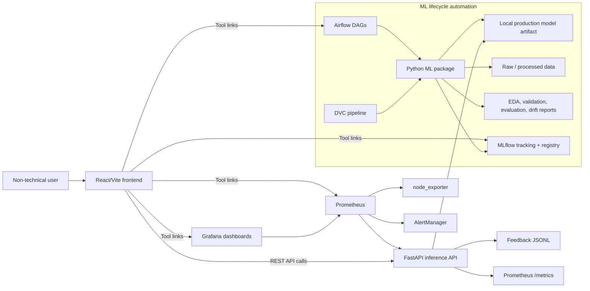

# Demo 01: Overall Architecture Walkthrough

## Goal

Use this script at the start of the recording to explain the complete architecture before showing the product. The point is to make it clear that this is not only a sentiment model, but a full local MLOps system covering training, tracking, versioning, deployment, monitoring, and maintenance.

## Before Recording

Start the full stack:

```bash
docker compose --profile mlflow-serving up -d
docker compose ps
```

Open these in browser tabs:

- Frontend: `http://localhost:5173`
- API docs: `http://localhost:8000/docs`
- Airflow: `http://localhost:8080`
- MLflow: `http://localhost:5001`
- Prometheus: `http://localhost:9091`
- Grafana: `http://localhost:3001`
- AlertManager: `http://localhost:19093`

Airflow login:

- Username: `admin`
- Password: `admin`

Grafana login:

- Username: `admin`
- Password: `admin`

## What To Show First

Open this architecture document or `docs/architecture.md` and show the system diagram.



## Recording Script

### 1. Introduce The Product

What to say:

> This project is a product review sentiment analyzer for e-commerce reviews. A user can paste a review and the system predicts whether the sentiment is positive, neutral, or negative. But the main focus of this project is not model novelty. The main focus is MLOps completeness: reproducibility, automation, tracking, deployment separation, monitoring, alerting, and maintenance.

Point at:

- `React/Vite frontend`
- `FastAPI inference API`
- `Local production model artifact`

Explain:

- The frontend is the user-facing product.
- The backend is the inference and operations API.
- The model is loaded as a production artifact, not trained inside the request path.
- The frontend and backend are loosely coupled through REST calls.

### 2. Explain Frontend And Backend Separation

What to show:

- Frontend tab: `http://localhost:5173`
- API docs tab: `http://localhost:8000/docs`

What to say:

> The frontend and backend are separate Docker services. The frontend never imports Python model code. It only calls the backend through configurable REST endpoints such as `/predict`, `/feedback`, `/ready`, `/model/info`, and `/metrics-summary`. This satisfies the loose coupling requirement because the UI and inference engine can be developed, tested, and deployed independently.

Key endpoint responsibilities:

- `POST /predict`: returns sentiment, confidence, class probabilities, explanation tokens, model version, MLflow run ID, and latency.
- `POST /feedback`: stores real-world ground-truth labels.
- `GET /health`: process-level health.
- `GET /ready`: model readiness.
- `GET /model/info`: model metadata and serving mode.
- `GET /metrics-summary`: frontend-friendly MLOps dashboard data.
- `GET /metrics`: Prometheus scrape endpoint.

### 3. Explain The ML Lifecycle Layer

Point at:

- `DVC pipeline`
- `Airflow DAGs`
- `Python ML package`
- `Raw / processed data`
- `Reports`
- `MLflow`

What to say:

> The ML lifecycle is implemented as versioned Python modules under the `ml/` package. The stages are ingestion, validation, EDA, preprocessing, feature baseline generation, model training, evaluation, acceptance checking, drift checking, and report publishing. These same stages are represented in both DVC and Airflow. DVC gives reproducibility and artifact lineage, while Airflow gives visual orchestration, logs, retries, and run history.

Explain the difference:

- DVC answers: "Can I reproduce the exact data/model pipeline from source control?"
- Airflow answers: "Can I operationally run and observe the pipeline with task history and logs?"
- MLflow answers: "Which experiment produced this model, with which parameters, metrics, and artifacts?"

### 4. Explain Data Flow

What to say:

> The data source is `SetFit/amazon_reviews_multi_en`, an English Amazon review dataset. During ingestion, each row is mapped into a canonical schema: `review_id`, `review_text`, `rating`, `sentiment`, `source`, and `ingested_at`. Ratings 1 and 2 map to negative, rating 3 maps to neutral, and ratings 4 and 5 map to positive. For the current run, the project uses ratings 1, 3, and 5 to keep the labels clearer.

Show command:

```bash
jq '{dataset_name, rows, fallback_used, cache_used, class_distribution, rating_distribution}' reports/ingestion_report.json
```

What to emphasize:

- Public dataset is documented.
- Ingestion script is version-controlled.
- Data is written to `data/raw`.
- Processed train/validation/test splits are deterministic.
- Reports are generated for validation, EDA, preprocessing, and drift baseline.

### 5. Explain Reproducibility And Traceability

What to show:

```bash
dvc dag
dvc status
dvc metrics show
```

What to say:

> Every major lifecycle step is represented in `dvc.yaml`. DVC tracks raw data, processed splits, baselines, model artifacts, metrics, and plots. Parameters are controlled through `params.yaml`, so changing a model hyperparameter or data setting reruns only the affected stages. The model metadata also stores the Git commit hash, DVC data version, and MLflow run ID. This gives traceability from a prediction back to the exact code, data, and experiment run that produced the model.

Traceability evidence:

```bash
jq '{model_name, mlflow_run_id, git_commit, data_version, trained_at}' models/model_metadata.json
```

### 6. Explain Experiment Tracking And Model Registry

What to show:

- Open MLflow at `http://localhost:5001`
- Open experiment `product-review-sentiment`
- Show multiple candidate model runs.
- Show selected model and registered model versions.

What to say:

> Training compares multiple lightweight candidate models, including TF-IDF logistic regression variants, SGD classifier, and Naive Bayes. Each candidate is logged as a separate MLflow run with parameters, metrics, artifacts, Git commit, DVC data version, and data information. The best accepted candidate is then exported as a local model artifact and also logged as an MLflow pyfunc model.

Metrics to mention:

- Accuracy
- Macro precision
- Macro recall
- Macro F1
- Class-wise F1
- Confusion matrix
- Inference latency
- Model size

### 7. Explain Deployment Architecture

Show Docker Compose services:

```bash
docker compose ps
```

What to say:

> The project is packaged with Docker Compose. The frontend, API, MLflow, Airflow webserver, Airflow scheduler, Postgres, Prometheus, AlertManager, node exporter, and Grafana all run as separate services. This gives environment parity for a local/on-prem deployment. The API has health and readiness checks, and the frontend depends on the API being healthy.

Important detail:

> The API serves the local production artifact for fast inference. The optional MLflow model server also serves the exported MLflow pyfunc artifact, which demonstrates MLflow APIification.

### 8. Explain Monitoring And Alerting

Point at:

- `Prometheus /metrics`
- `Grafana dashboards`
- `AlertManager`
- `node_exporter`

What to say:

> Monitoring is split into application-level, model-level, pipeline-level, data-level, and infrastructure-level metrics. FastAPI exposes Prometheus metrics for request counts, latency, errors, prediction distribution, feedback count, feedback accuracy, model loaded state, acceptance status, drift score, and pipeline timing. Node exporter adds CPU, memory, disk, and filesystem metrics. Prometheus evaluates alert rules, AlertManager handles routing and silencing, and Grafana visualizes the system in near real time.

Show:

```bash
curl -s http://localhost:8000/metrics | head
curl -s http://localhost:8000/metrics-summary | jq '{api, model, maintenance}'
```

### 9. Explain Maintenance And Retraining

What to show:

- Airflow DAG: `sentiment_monitoring_maintenance`
- File: `reports/maintenance_report.json`

Command:

```bash
jq '{action, should_retrain, reasons, drift, feedback, cooldown}' reports/maintenance_report.json
```

What to say:

> The maintenance DAG checks data drift and feedback-based performance decay. If drift exceeds the threshold or feedback accuracy drops below the configured threshold after enough feedback labels, it triggers the main training pipeline. A cooldown is included so the same unresolved drift condition does not trigger repeated retraining every hour. This is important because operational automation should be controlled, not noisy.

### 10. Close The Architecture Section

What to say:

> So the architecture covers the complete MLOps loop: a user-facing application, versioned data pipelines, reproducible training, MLflow experiment tracking, model acceptance gates, containerized deployment, Prometheus and Grafana monitoring, AlertManager alerting, feedback collection, drift detection, and automated retraining.

Transition:

> Next I will show the happy path: starting from a user prediction in the frontend, then following the evidence through the API, MLOps dashboard, Airflow, DVC, MLflow, and Grafana.
