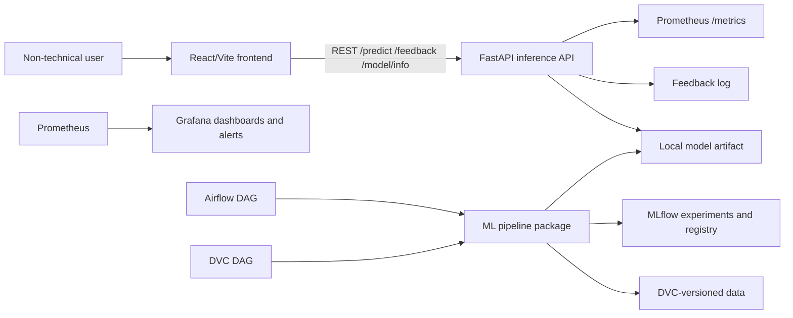
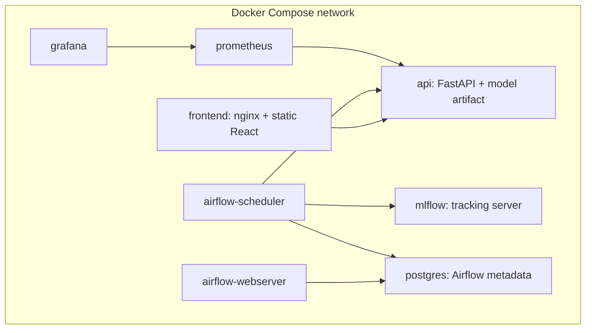
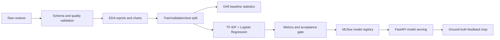

# Architecture

## System Overview

The application is split into independent services so the frontend and backend model inference engine are loosely coupled through REST APIs only.

## Blocks

- **Frontend:** Non-technical UI for review analysis and an MLOps dashboard.
- **FastAPI API:** Owns prediction, feedback, health, readiness, model metadata, and Prometheus metrics.
- **ML package:** Owns ingestion, validation, preprocessing, baseline statistics, training, evaluation, drift detection, and report publishing.
- **Airflow:** Provides visual orchestration, retries, status, and run history.
- **DVC:** Provides reproducible data/model pipeline DAG and artifact versioning.
- **MLflow:** Tracks parameters, metrics, artifacts, Git commit hash, DVC state, and registered model versions.
- **Prometheus/Grafana:** Monitors API health, latency, error rates, model loading, prediction distribution, feedback, and drift.

## Deployment View

## Data Flow

## Security Notes

The submitted project is local-only and contains no private customer data. Secrets are kept out of Git through `.env` and `.env.example`. Production-like deployment would require TLS, authenticated service endpoints, encrypted artifact storage, and stricter access control around Airflow, MLflow, and Grafana.
