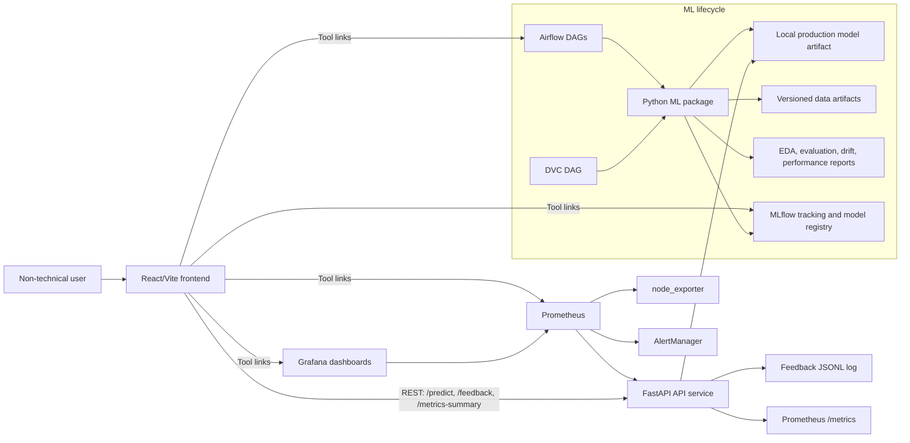
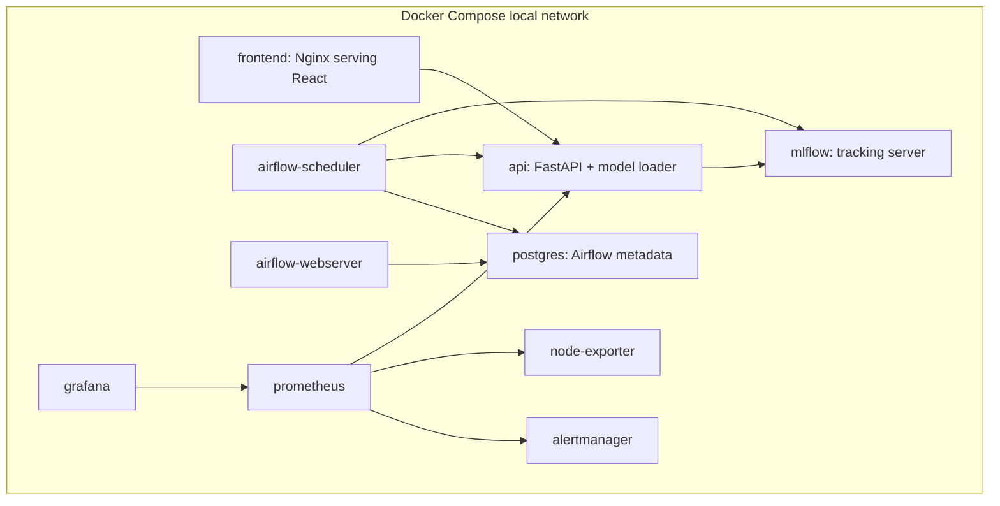
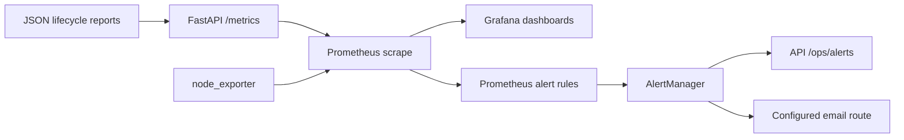

# Architecture

## Purpose

This project is a local, end-to-end MLOps application for e-commerce review sentiment analysis. The product layer lets a non-technical user paste a product review and receive a sentiment prediction. The MLOps layer demonstrates reproducible data processing, tracked experimentation, orchestrated pipelines, deployment separation, monitoring, alerting, feedback collection, and rollback readiness.

The architecture intentionally prioritizes MLOps completeness over model complexity. The deployed model is a fast TF-IDF plus Logistic Regression pipeline because it is explainable, reproducible, and reliable on local hardware.

## High-Level System Diagram

## Service Responsibilities

| Block | Responsibility | Evidence |
| --- | --- | --- |
| React/Vite frontend | Analyzer UI, feedback form, in-app guide, product tour, MLOps dashboard, status-aware pipeline visualization | `apps/frontend/src/main.jsx`, `apps/frontend/src/styles.css` |
| FastAPI API | Health/readiness, prediction, feedback, model metadata, monitoring summary, Prometheus metrics | `apps/api/sentiment_api/` |
| ML pipeline package | Ingestion, validation, EDA, preprocessing, baseline features, training, evaluation, acceptance, drift, report publishing | `ml/` |
| DVC | Reproducible staged lifecycle and artifact versioning | `dvc.yaml`, `params.yaml`, `dvc.lock` |
| Airflow | Visual orchestration, retries, logs, DAG run history, batch input pipeline, email alert hooks | `airflow/dags/` |
| MLflow | Experiment tracking, metrics, artifacts, model registry metadata, run IDs | `ml/training/train.py`, `MLproject` |
| Prometheus | Application, model, pipeline, drift, alert, and infrastructure metric scraping | `infra/prometheus/` |
| AlertManager | Alert routing, grouping, silencing, and notification delivery | `infra/alertmanager/` |
| Grafana | Operational dashboards for API, ML, pipeline, drift, feedback, and infrastructure | `infra/grafana/` |
| Docker Compose | Local environment parity and multi-service packaging | `docker-compose.yml`, `infra/docker/` |

## Deployment View

Published local ports:

| Service | Host URL |
| --- | --- |
| Frontend | `http://localhost:5173` |
| API | `http://localhost:8000` |
| API docs | `http://localhost:8000/docs` |
| MLflow | `http://localhost:5001` |
| Airflow | `http://localhost:8080` |
| Prometheus | `http://localhost:9091` |
| Grafana | `http://localhost:3001` |
| AlertManager | `http://localhost:19093` |
| Node exporter | `http://localhost:19100/metrics` |

## ML Lifecycle Diagram

```mermaid
flowchart LR
  A["Ingest raw reviews"] --> B["Validate schema and quality"]
  B --> C["EDA reports and charts"]
  C --> D["Clean and split data"]
  D --> E["Generate drift baselines"]
  E --> F["Train candidate models"]
  F --> G["Evaluate selected model"]
  G --> H["Acceptance gate"]
  H --> I["Drift check"]
  I --> J["Publish pipeline report"]
  J --> K["FastAPI serving"]
  K --> L["Feedback and monitoring"]
```

Current run evidence:

- Dataset: `SetFit/amazon_reviews_multi_en`
- Raw rows: `15000`
- Processed rows: `14987`
- Rejected rows: `13`
- Selected model: `tfidf_logistic_tuned`
- Test macro F1: `0.7737`
- Latency: `0.0467 ms` per review in evaluation benchmark
- Pipeline duration: `44.6 s`
- Lifecycle stages with timing: `9`

## Frontend And Backend Coupling

The frontend and backend are intentionally loose-coupled. The frontend does not import model or backend code. It depends only on REST contracts and an environment-configurable API base URL.

Frontend calls:

- `POST /predict`
- `POST /feedback`
- `GET /ready`
- `GET /model/info`
- `GET /metrics-summary`
- `POST /monitoring/refresh`

The backend does not depend on frontend internals. This separation supports independent Docker images and independent deployment.

## Monitoring Flow

Prometheus metrics cover request rates, latency, errors, prediction distribution, model loaded state, fallback state, macro F1, model acceptance, drift, feedback, data quality, pipeline duration, stage throughput, and infrastructure health.

## Security Notes

This is a local/on-prem course project. The repository does not commit secrets or private customer data. Configuration is documented through `.env.example`, while local `.env` values stay outside Git.

Production-like hardening would require:

- TLS for all service communication
- Authentication for API, MLflow, Airflow, Grafana, and Prometheus
- Encrypted artifact and feedback storage
- Role-based access control
- Network isolation between internal services and public endpoints
