# High-Level Design

## Goal

Build a product review sentiment analyzer that demonstrates a complete MLOps lifecycle: automated data processing, experiment tracking, reproducible training, versioned artifacts, API deployment, UI separation, monitoring, feedback, and retraining readiness.

## Design Choices

- **Model:** TF-IDF + Logistic Regression is the default production model because it is fast, explainable, lightweight, and reliable on local hardware.
- **Frontend:** React/Vite is a separate service and talks to the backend only through configurable REST URLs.
- **Backend:** FastAPI exposes product APIs and operational APIs. It loads a local model artifact generated by the training pipeline.
- **Pipelines:** Airflow provides the visual pipeline console. DVC provides reproducible pipeline execution and artifact versioning.
- **Tracking:** MLflow records parameters, metrics, artifacts, Git commit hash, and DVC state.
- **Monitoring:** Prometheus scrapes API metrics and Grafana visualizes service health, latency, errors, predictions, feedback, and drift.
- **Packaging:** Docker Compose runs all major services locally without cloud dependencies.

## Lifecycle

```mermaid
flowchart LR
  Define["Problem and metrics"] --> Ingest["Ingest reviews"]
  Ingest --> Validate["Validate data"]
  Validate --> Engineer["Preprocess and baseline features"]
  Engineer --> Train["Train experiments"]
  Train --> Register["Register accepted model"]
  Register --> Deploy["Serve via FastAPI"]
  Deploy --> Monitor["Prometheus + Grafana"]
  Monitor --> Feedback["Ground truth feedback"]
  Feedback --> Retrain["Retraining trigger"]
  Retrain --> Train
```

## Success Metrics

- Macro F1 score target: `>= 0.75`.
- Typical single-review latency target: `< 200 ms`.
- API exposes `/health` and `/ready`.
- Every model has a corresponding MLflow run ID and Git commit hash.
- Data and model artifacts are reproducible through DVC stages.

## Loose Coupling

The frontend does not import backend code or model code. It uses only:

- `POST /predict`
- `POST /feedback`
- `GET /health`
- `GET /ready`
- `GET /model/info`
- `GET /metrics-summary`

The backend does not depend on frontend internals. The API base URL is configurable with `VITE_API_BASE_URL`.

