# High-Level Design

## Problem Statement

The application classifies e-commerce product reviews into `positive`, `neutral`, or `negative` sentiment. The user-facing objective is simple: help a business user quickly understand customer feedback without manually reading every review.

The course objective is broader: demonstrate a complete local MLOps lifecycle with automation, reproducibility, versioning, experiment tracking, deployment, monitoring, alerting, feedback, and documentation.

## Success Criteria

| Category | Metric | Target | Current Evidence |
| --- | --- | --- | --- |
| ML quality | Test macro F1 | `>= 0.75` | `0.7737` |
| Business latency | Single-review inference | `< 200 ms` | `0.0467 ms` evaluation benchmark |
| Reproducibility | DVC pipeline | `dvc repro` succeeds | Passed |
| Traceability | Git + MLflow + DVC | Model metadata includes all three | Present in `models/model_metadata.json` |
| Deployment | Separate frontend/backend | Docker Compose services | Present |
| Monitoring | API, ML, pipeline, drift, infra metrics | Prometheus/Grafana/AlertManager | Present |

## Architectural Decisions

| Decision | Choice | Rationale |
| --- | --- | --- |
| Model | TF-IDF plus Logistic Regression | Fast, explainable, local hardware friendly, reliable for demo |
| Frontend | React/Vite | Strong UI/UX, separate build artifact, configurable API URL |
| API | FastAPI | Typed schemas, automatic docs, health/readiness, Prometheus integration |
| Pipeline orchestration | Airflow | Visible DAG graph, retries, logs, operational console |
| Reproducibility | DVC | Staged DAG, artifact hashes, parameterized experiments |
| Experiment tracking | MLflow | Run IDs, parameters, metrics, artifacts, registry metadata |
| Monitoring | Prometheus, Grafana, AlertManager, node_exporter | Application plus infrastructure observability |
| Packaging | Docker Compose | Local environment parity without cloud services |

## Functional Components

### User Product Flow

1. User opens the frontend.
2. User pastes or selects a sample product review.
3. Frontend sends `POST /predict`.
4. API validates input and calls the loaded model.
5. API returns sentiment, confidence, class probabilities, influential tokens, latency, model version, and MLflow run ID.
6. User optionally submits the actual sentiment through `POST /feedback`.
7. Feedback becomes monitoring/retraining input.

### MLOps Flow

1. DVC runs the reproducible lifecycle DAG.
2. Airflow provides an orchestration console and batch input automation.
3. MLflow records model experiments and artifacts.
4. FastAPI serves the selected local-production model.
5. Prometheus scrapes API and infrastructure metrics.
6. Grafana visualizes service health, model quality, drift, feedback, pipeline duration, and resource usage.
7. AlertManager routes threshold-based alerts and supports silencing.

## Lifecycle Design

```mermaid
flowchart LR
  Business["Problem and success metrics"] --> Data["Data ingestion and validation"]
  Data --> EDA["EDA and preprocessing"]
  EDA --> Baseline["Drift baseline"]
  Baseline --> Experiments["MLflow candidate experiments"]
  Experiments --> Gate["Evaluation and acceptance gate"]
  Gate --> Serve["FastAPI serving"]
  Serve --> Monitor["Prometheus and Grafana"]
  Monitor --> Feedback["Ground-truth feedback"]
  Feedback --> Retrain["Airflow/DVC retraining readiness"]
  Retrain --> Experiments
```

## Loose Coupling

The frontend and backend are separate software blocks:

- Frontend has no direct access to model files, DVC, MLflow, or Python code.
- Frontend communicates only through REST APIs.
- Backend exposes stable API contracts and does not depend on frontend code.
- API base URL is configured through `VITE_API_BASE_URL`.
- Docker Compose builds the frontend and API as independent services.

## Failure And Recovery Strategy

| Failure | Detection | Mitigation |
| --- | --- | --- |
| API unavailable | `/health`, Prometheus `up`, frontend error state | Restart API container, inspect logs |
| Model missing | `/ready`, `sentiment_model_loaded` | Re-run `dvc repro` or restore model artifact |
| Bad data | validation report, rejected rows, dashboard warnings | Quarantine/reject rows, inspect validation report |
| Model quality drop | acceptance gate, macro F1 gauge | Keep previous model, retrain before promotion |
| Drift | drift report and alert rule | Trigger retraining review |
| High latency | Prometheus latency histogram and alert | Use lightweight model, inspect host metrics |
| Docker service issue | health checks and smoke test | `docker compose logs <service>` |

## Rollback Strategy

Rollback is model-artifact driven:

1. Keep previous model versions in MLflow and DVC.
2. Restore an older Git/DVC state with `git checkout <commit>` and `dvc checkout`.
3. Point the API to the desired model artifact or registry stage/version.
4. Restart the API service.
5. Verify `/ready`, `/predict`, `/metrics`, and frontend behavior.

## Known Local-Demo Limitations

- TLS and authentication are documented but not enabled in the local demo.
- Continuous scheduled retraining is not enabled by default, but the retraining path exists through DVC and Airflow.
- The primary dataset does not include product-category metadata, so category-level bias analysis is limited.
- The model is intentionally lightweight; transformer improvement is future work, not required for the course rubric.

