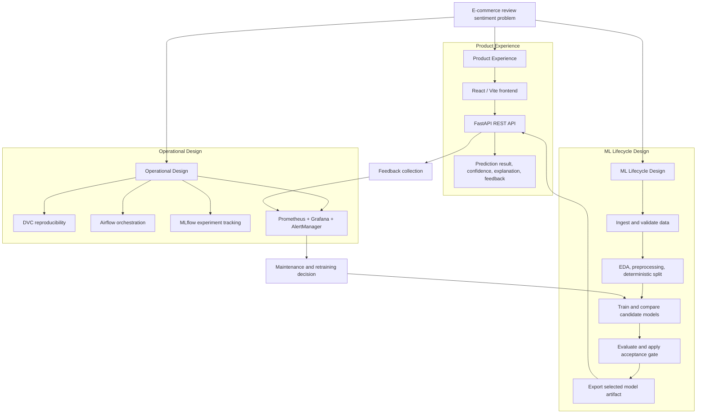
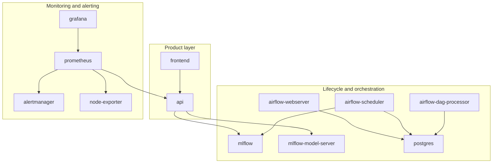
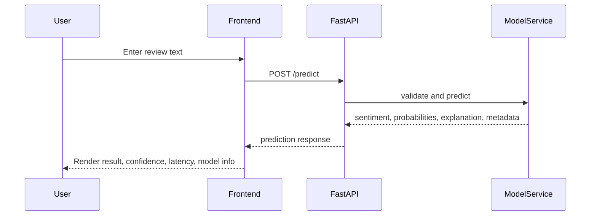
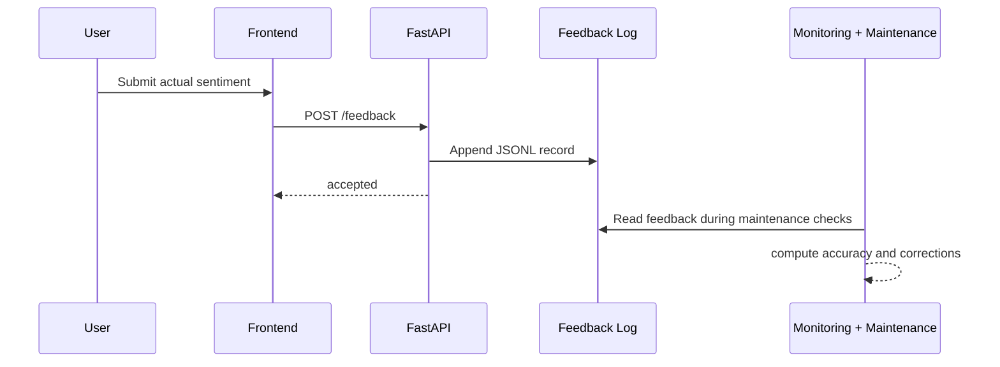
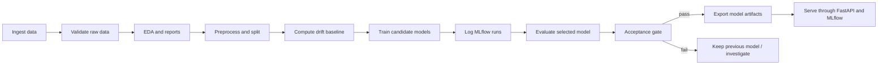

# High-Level Design

## 1. Purpose

This document describes the high-level design of the **Product Review Sentiment Analyzer for E-commerce**. The system was designed not just as a sentiment classifier, but as a complete local MLOps product that demonstrates:

- automated data ingestion and preprocessing
- reproducible training and evaluation
- experiment tracking and model traceability
- API-based deployment with frontend/backend separation
- monitoring, alerting, feedback collection, and retraining readiness

The design prioritizes **MLOps completeness, reproducibility, observability, and local deployability** over model novelty.

## 2. Problem Summary

E-commerce platforms collect a large number of customer reviews. Manually reading and categorizing them is time-consuming and inconsistent. This system allows a user to submit a review and receive a sentiment prediction of:

- `positive`
- `neutral`
- `negative`

The project also exposes the underlying lifecycle needed to operate such a model in a disciplined way: data validation, experiment comparison, deployment packaging, monitoring, alerting, feedback logging, and retraining decisions.

## 3. Design Goals

### 3.1 Functional Goals

- classify a single review through a web interface
- expose confidence, class probabilities, explanation tokens, latency, and model metadata
- collect user feedback when ground truth becomes available
- provide a separate MLOps view for health, pipeline state, drift, and supporting tools

### 3.2 Non-Functional Goals

- **reproducibility:** every model should be recoverable from code, parameters, data state, and MLflow run metadata
- **traceability:** model predictions should be tied back to the selected training run
- **performance:** single-review inference should remain below `200 ms`
- **operability:** the stack must expose health, readiness, metrics, alerts, and logs
- **environment parity:** local development and demo deployment should be containerized
- **loose coupling:** frontend and backend must remain separate software blocks communicating only through REST

## 4. Constraints and Assumptions

| Item | Design impact |
| --- | --- |
| No cloud services allowed | All services run locally through Docker Compose |
| Final evaluation emphasizes MLOps | Tooling and lifecycle completeness matter more than model complexity |
| Local hardware only | Lightweight, explainable classical NLP model is preferred |
| Public review dataset | Need explicit validation, EDA, and documented limitations |
| Demonstration-driven evaluation | System must be easy to explain visually through UI, DAGs, and dashboards |

## 5. High-Level Architecture

The system is divided into four major layers:

1. **Product layer**  
   React/Vite frontend for review submission, result display, user guidance, and MLOps visibility.

2. **Serving layer**  
   FastAPI backend that loads the selected model, exposes prediction and feedback endpoints, and emits Prometheus metrics.

3. **ML lifecycle layer**  
   Python ML package, DVC pipeline, MLflow experiment tracking, and Airflow orchestration.

4. **Observability layer**  
   Prometheus, Grafana, AlertManager, and node exporter for health, latency, drift, pipeline, and infrastructure monitoring.

### 5.1 High-Level Design Diagram

This high-level design diagram focuses on the **logical design of the system**, not just the runtime components. It shows how the project is structured around three concerns: the product experience, the ML lifecycle, and the operational MLOps layer. The diagram is meant to answer the question: **how is the solution designed conceptually from problem definition to serving, monitoring, feedback, and retraining?**

### 5.2 Container and Service View

## 6. Major Architectural Decisions

| Decision | Chosen approach | Why it was chosen |
| --- | --- | --- |
| Model family | TF-IDF + Logistic Regression | Small, fast, explainable, and reliable on local hardware |
| Frontend | React/Vite | Better UX, strong separation from backend, simple static deployment |
| API | FastAPI | Typed schemas, built-in docs, clean REST contracts, health/readiness support |
| Reproducibility | DVC | Stage graph, parameterized pipeline, artifact tracking, `dvc repro` support |
| Experiment tracking | MLflow | Tracks runs, metrics, artifacts, and model lineage |
| Orchestration | Airflow | DAG UI, scheduling, retries, history, operational console |
| Monitoring | Prometheus + Grafana | Standard metrics collection and near-real-time visualization |
| Alerting | AlertManager | Rule-based routing, grouping, silencing, and notification flow |
| Packaging | Docker Compose | Local parity across services without requiring cloud infrastructure |

## 7. Core Functional Flows

### 7.1 User Prediction Flow

### 7.2 Feedback Loop

### 7.3 Training and Promotion Flow

## 8. Component Responsibilities

| Component | Responsibility | Key outputs |
| --- | --- | --- |
| Frontend | Review submission, feedback form, in-app guide, MLOps dashboard, external tool navigation | Browser UI |
| FastAPI API | Prediction, feedback, health/readiness, metrics summary, Prometheus exposition | REST responses and metrics |
| Model service | Load model, support local or MLflow serving mode, compute explanation payload | Prediction contract |
| ML package | Data ingestion, validation, EDA, preprocessing, features, training, evaluation, drift, maintenance | CSV, JSON, Markdown, model artifacts |
| DVC | Reproducible lifecycle graph and dependency management | `dvc.yaml`, `dvc.lock`, versioned artifacts |
| Airflow | Orchestration and operational DAG visibility | DAG runs, retries, task logs |
| MLflow | Experiment tracking and model packaging | Run IDs, metrics, artifacts, model package |
| Prometheus | Metric scraping and alert rule evaluation | Time-series data |
| Grafana | Dashboarding for system and operations views | Live dashboards |
| AlertManager | Alert grouping and routing | Alert notifications |

## 9. Data and Model Lifecycle Design

### 9.1 Data Lifecycle

- Raw public review data is ingested from `SetFit/amazon_reviews_multi_en`.
- Validation checks schema, nulls, duplicates, label consistency, and class coverage.
- Preprocessing normalizes text, removes invalid rows, and creates deterministic splits.
- Rejected rows are preserved separately for auditability.
- Baseline statistics are stored for later drift comparison.

### 9.2 Model Lifecycle

- Multiple candidate models are trained from the same processed split.
- Each candidate is logged to MLflow with parameters, metrics, and artifacts.
- The selection rule promotes the best candidate that satisfies acceptance criteria.
- The chosen model is exported both as a local `joblib` artifact and as an MLflow pyfunc artifact.
- The API reads model metadata to expose version and run-level traceability.

## 10. Observability and Maintenance Design

### 10.1 Monitoring Scope

The monitoring design covers:

- API health and readiness
- request volume, latency, and error rate
- invalid input rates
- prediction distribution
- model loaded / fallback state
- model quality and acceptance status
- drift score and drift flag
- feedback accuracy and correction volume
- pipeline timing and throughput
- infrastructure CPU, memory, and disk

### 10.2 Maintenance Logic

Retraining readiness is not based on one signal alone. The maintenance policy combines:

- drift score threshold
- observed feedback accuracy
- recent correction count
- cooldown protection to avoid repeated retriggers

This design makes retraining more realistic and less noisy than a single-threshold mechanism.

## 11. Loose Coupling Strategy

Loose coupling is a central design rule in this project.

- The frontend does not import backend or model code.
- The backend exposes stable REST contracts rather than UI-specific internals.
- Tool URLs are configuration-driven rather than hardwired into the frontend logic.
- Frontend and backend are packaged in separate containers.
- Training/orchestration code is separate from serving code.

This separation improves testability, demo clarity, and deployment flexibility.

## 12. Failure and Recovery Design

| Failure case | Detection mechanism | Recovery approach |
| --- | --- | --- |
| API process down | `/health`, Prometheus `up`, frontend error state | Restart API container, inspect logs |
| Model artifact missing | `/ready`, model-loaded gauge | Reproduce artifacts through DVC or restore previous model |
| Validation issues in raw data | Validation report and dashboard warnings | Reject or quarantine bad data and inspect report |
| Model quality below gate | Evaluation report and acceptance check | Do not promote candidate; keep prior artifact |
| Drift detected | Drift report, Prometheus alert rule | Review retraining conditions and rerun training path |
| High latency | Histogram, p95 latency panels, alerts | Inspect resource usage or revert to lighter model |
| Batch pipeline malformed input | Airflow task failure and quarantine path | Preserve file for analysis and rerun corrected batch |

## 13. Rollback Strategy

Rollback is model-driven rather than UI-driven.

1. Identify the previous acceptable model state through MLflow metadata and DVC artifacts.
2. Restore the desired code/data state using Git and DVC.
3. Point the API to the target artifact or serving configuration.
4. Restart the API service.
5. Verify `/ready`, `/predict`, `/metrics`, and frontend behavior.

This keeps rollback simple, deterministic, and aligned with the reproducibility story.

## 14. Known Limitations

- The local demo does not enable full production authentication or TLS.
- The model is intentionally lightweight rather than transformer-based.
- Feedback in the local setup is mostly demo-driven rather than naturally accumulated from production traffic.
- Batch operational ingestion is implemented for orchestration coverage, while user-facing batch inference is future work.

## 15. Summary

At the HLD level, this system is a **separated product + lifecycle + observability architecture**. The product experience remains simple for a non-technical user, while the underlying design demonstrates the full MLOps story: reproducible data flow, tracked experimentation, automated orchestration, containerized deployment, monitoring, alerting, feedback capture, and retraining readiness.
