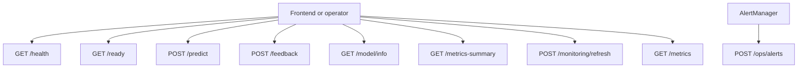
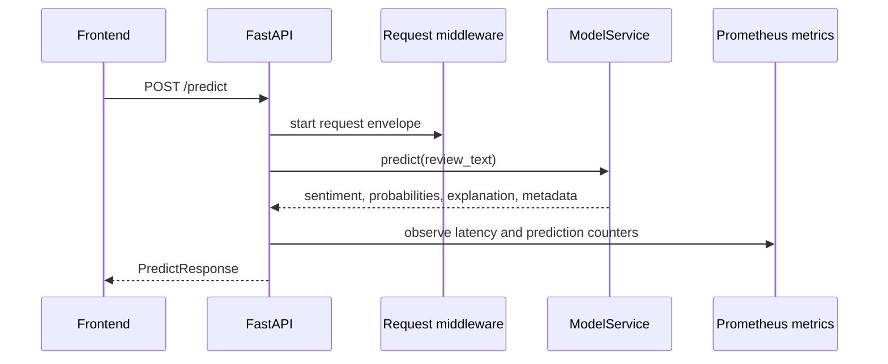
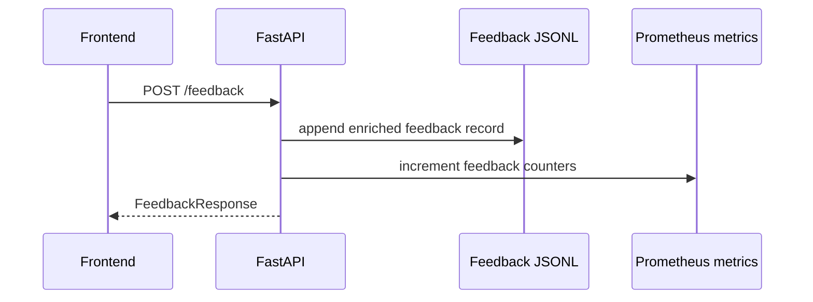
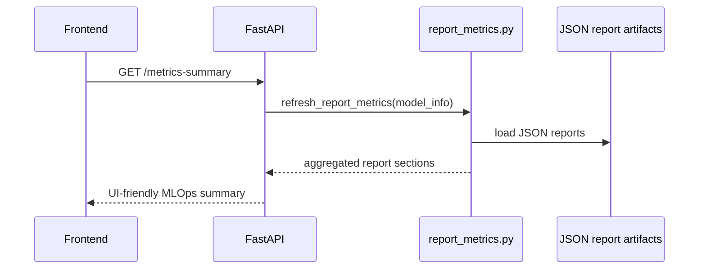
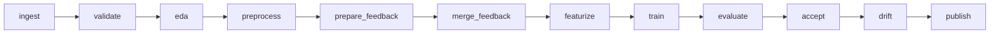
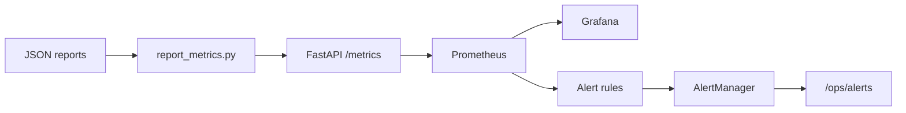

# Low-Level Design

## 1. Purpose

This document defines the low-level design of the Product Review Sentiment Analyzer. It focuses on:

- API endpoint contracts
- request and response schemas
- module responsibilities
- runtime interactions between components
- validation rules and error handling
- operational and monitoring interfaces

The goal of this document is to make the implementation behavior explicit enough that the API layer, ML layer, and monitoring layer can be understood and verified independently.

## 2. Runtime Entry Points

| Layer | Entry point | Responsibility |
| --- | --- | --- |
| Frontend | `apps/frontend/src/main.jsx` | Main UI, route-level state, analyzer, MLOps dashboard, guide panels |
| API | `apps/api/sentiment_api/main.py` | FastAPI app, middleware, endpoints, exception handlers |
| Model loading | `apps/api/sentiment_api/model_service.py` | Artifact loading, local inference, MLflow serving integration, fallback inference |
| Settings | `apps/api/sentiment_api/config.py` | Environment-driven runtime configuration |
| Metrics | `apps/api/sentiment_api/metrics.py` | Prometheus counters, gauges, histograms, summaries |
| Report-backed gauges | `apps/api/sentiment_api/report_metrics.py` | Converts JSON report artifacts into Prometheus metrics |

## 3. Base URL and Environment

Local default API base:

```text
http://localhost:8000
```

Frontend configuration:

```text
VITE_API_BASE_URL=http://localhost:8000
```

Important API runtime variables:

| Variable | Meaning |
| --- | --- |
| `MODEL_PATH` | local trained model artifact path |
| `MODEL_METADATA_PATH` | metadata JSON for selected model |
| `FEATURE_IMPORTANCE_PATH` | explanation-token metadata |
| `MODEL_SERVING_MODE` | `local` or `mlflow` |
| `MLFLOW_SERVING_URL` | MLflow model-serving inference URL |
| `FEEDBACK_PATH` | JSONL feedback log |
| `ALLOW_FALLBACK_READY` | whether fallback mode counts as ready |
| `CORS_ORIGINS` | allowed frontend origins |
| `MLFLOW_TRACKING_URI` | MLflow tracking location |

## 4. API Design

### 4.1 API Surface Overview



### 4.2 Endpoint Summary

| Endpoint | Method | Primary consumer | Purpose |
| --- | --- | --- | --- |
| `/health` | `GET` | Docker / operators | Process-level liveness |
| `/ready` | `GET` | Docker / frontend / operators | Model-readiness signal |
| `/predict` | `POST` | Frontend analyzer | Single-review sentiment inference |
| `/feedback` | `POST` | Frontend analyzer | Ground-truth capture |
| `/model/info` | `GET` | Frontend MLOps screen | Expose loaded-model metadata |
| `/metrics-summary` | `GET` | Frontend MLOps screen | UI-friendly lifecycle summary |
| `/monitoring/refresh` | `POST` | Frontend / operators | Refresh report-backed gauges |
| `/metrics` | `GET` | Prometheus | Prometheus exposition endpoint |
| `/ops/alerts` | `POST` | AlertManager | Receive alert notifications |
| `/ops/demo/error` | `POST` | Demo-only operators | Intentional 500 for monitoring demo |

## 5. Request and Response Schemas

### 5.1 `GET /health`

**Purpose**  
Returns basic liveness of the FastAPI process.

**Response**

```json
{
  "status": "ok",
  "service": "Product Review Sentiment API"
}
```

**Status codes**

- `200 OK`

---

### 5.2 `GET /ready`

**Purpose**  
Returns readiness for orchestration. The API is considered ready when:

- a model is loaded locally, or
- fallback readiness is explicitly allowed and fallback mode is active

**Response**

```json
{
  "ready": true,
  "model_loaded": true,
  "fallback_mode": false,
  "model_path": "models/sentiment_model.joblib"
}
```

**Status codes**

- `200 OK`

---

### 5.3 `POST /predict`

**Purpose**  
Predict sentiment for one review.

**Request schema**

```json
{
  "review_text": "The product quality is excellent and delivery was fast."
}
```

**Field rules**

| Field | Type | Constraint |
| --- | --- | --- |
| `review_text` | string | required |
| `review_text` | string | minimum length `1` |
| `review_text` | string | maximum length `5000` |

**Response schema**

```json
{
  "sentiment": "positive",
  "confidence": 0.93,
  "class_probabilities": {
    "negative": 0.02,
    "neutral": 0.05,
    "positive": 0.93
  },
  "explanation": [
    { "token": "excellent", "weight": 0.41 },
    { "token": "fast", "weight": 0.22 }
  ],
  "model_version": "local-production",
  "mlflow_run_id": "61f2ee995e7d4084a210a3513d83eec8",
  "latency_ms": 37.4
}
```

**Response fields**

| Field | Meaning |
| --- | --- |
| `sentiment` | predicted class |
| `confidence` | probability of predicted class |
| `class_probabilities` | full class-probability distribution |
| `explanation` | top contributing tokens for the predicted class |
| `model_version` | selected model version metadata |
| `mlflow_run_id` | traceability back to tracked experiment |
| `latency_ms` | end-to-end model-service latency |

**Status codes**

- `200 OK`
- `400 Bad Request` for model-service value errors
- `422 Unprocessable Entity` for request validation errors
- `500 Internal Server Error` for unhandled failures

---

### 5.4 `POST /feedback`

**Purpose**  
Persist a feedback event once the actual sentiment becomes available.

**Request schema**

```json
{
  "review_text": "The product quality is excellent and delivery was fast.",
  "predicted_sentiment": "positive",
  "actual_sentiment": "positive",
  "source": "demo"
}
```

**Field rules**

| Field | Type | Constraint |
| --- | --- | --- |
| `review_text` | string | required, `1` to `5000` chars |
| `predicted_sentiment` | enum | `negative`, `neutral`, `positive` |
| `actual_sentiment` | enum | `negative`, `neutral`, `positive` |
| `source` | string | optional, defaults to `demo` |

**Response schema**

```json
{
  "status": "accepted",
  "stored": true
}
```

**Write behavior**

- appends one JSON record per line to the configured feedback log
- enriches stored record with:
  - `submitted_at`
  - `feedback_type`
  - `is_correction`

---

### 5.5 `GET /model/info`

**Purpose**  
Expose serving mode and selected model metadata.

**Returned fields include**

- `model_loaded`
- `fallback_mode`
- `serving_mode`
- `model_path`
- `mlflow_serving_url`
- `metadata.model_name`
- `metadata.model_version`
- `metadata.mlflow_run_id`
- `metadata.data_version`
- `metadata.trained_at`

---

### 5.6 `GET /metrics-summary`

**Purpose**  
Provide a frontend-friendly summary for the MLOps dashboard.

**Returned sections include**

- `api`
- `model`
- `links`
- `ingestion`
- `validation`
- `eda`
- `preprocessing`
- `model_comparison`
- `evaluation`
- `acceptance_gate`
- `drift`
- `pipeline`
- `pipeline_summary`
- `pipeline_performance`
- `batch_pipeline`

This endpoint is not meant to be scraped by Prometheus. It is a UI aggregation layer that combines model state with report-derived lifecycle summaries.

---

### 5.7 `POST /monitoring/refresh`

**Purpose**  
Refresh report-backed Prometheus gauges on demand.

**Response**

```json
{
  "status": "refreshed",
  "pipeline_summary": {
    "total_duration_seconds": 44.6244435019762,
    "selected_model": "tfidf_logistic_tuned",
    "test_macro_f1": 0.7736922040873718
  }
}
```

---

### 5.8 `GET /metrics`

**Purpose**  
Expose Prometheus metrics in text format.

**Behavior**

- refreshes process metrics
- refreshes report-backed lifecycle metrics
- returns `CONTENT_TYPE_LATEST`

---

### 5.9 `POST /ops/alerts`

**Purpose**  
Receive AlertManager webhook payloads and count alert notifications by label.

**Response**

```json
{
  "status": "accepted",
  "alerts_received": 1
}
```

---

### 5.10 `POST /ops/demo/error`

**Purpose**  
Generate an intentional `500` error for monitoring demo purposes.

**Availability**

- only enabled when `ENABLE_DEMO_OPS_ENDPOINTS=true`

## 6. API Interaction Sequences

### 6.1 Prediction Sequence



### 6.2 Feedback Sequence



### 6.3 Metrics Summary Sequence



## 7. Internal Module Design

### 7.1 API Package Structure

| Module | Responsibility |
| --- | --- |
| `main.py` | FastAPI app creation, middleware, routes, exception handlers |
| `config.py` | runtime settings from environment variables |
| `schemas.py` | request and response schema definitions |
| `model_service.py` | model loading, local inference, MLflow inference mode, fallback mode |
| `metrics.py` | Prometheus metric declarations and process refresh logic |
| `report_metrics.py` | reads lifecycle reports and updates gauges |
| `logging_config.py` | JSON-aware logging setup |

### 7.2 `ModelService` Design

`ModelService` is the serving facade that hides backend-specific inference details.

**Key behaviors**

- loads local `joblib` model artifact when available
- loads model metadata and feature-importance metadata
- supports two serving modes:
  - `local`
  - `mlflow`
- supports fallback keyword inference if no trained local model exists
- normalizes all modes to the same `PredictResponse` contract

**Important methods**

| Method | Purpose |
| --- | --- |
| `load()` | load model and metadata artifacts |
| `predict()` | unified public inference method |
| `_predict_via_mlflow_serving()` | call MLflow model server via HTTP |
| `_predict_proba()` | compute class probabilities for local model |
| `_explain_model_prediction()` | derive top contributing tokens |
| `_fallback_predict()` | demo-safe keyword fallback |
| `info()` | expose serving metadata for `/ready`, `/model/info`, and `/metrics-summary` |

### 7.3 Middleware and Exception Handling

The request middleware wraps every HTTP request in one consistent envelope:

- assigns or propagates a request ID
- measures latency
- increments active request gauges
- records request count by endpoint, method, and status code
- logs structured completion events

Exception handling is explicit:

| Error source | Behavior |
| --- | --- |
| `ValueError` from model logic | returns `400` JSON response |
| `RequestValidationError` | returns `422` JSON response and increments invalid-review counters |
| unhandled exception | logged, counted, and re-raised as server failure |

## 8. Data Contracts

### 8.1 Canonical Review Schema

| Column | Type | Meaning |
| --- | --- | --- |
| `review_id` | string | stable review identifier |
| `review_text` | string | product review body |
| `rating` | integer | original star rating |
| `sentiment` | string | mapped class label |
| `source` | string | dataset or origin label |
| `ingested_at` | datetime string | ingestion timestamp |

### 8.2 Sentiment Mapping

| Rating | Sentiment |
| --- | --- |
| `1-2` | `negative` |
| `3` | `neutral` |
| `4-5` | `positive` |

The current default sampled training subset emphasizes ratings `1`, `3`, and `5` for clearer separation and a balanced local training set.

## 9. ML Package Responsibilities

| Package | Responsibility | Primary outputs |
| --- | --- | --- |
| `ml.data_ingestion` | ingest dataset or offline fallback | raw CSV + ingestion report |
| `ml.validation` | schema and quality validation | validation JSON/Markdown |
| `ml.eda` | descriptive statistics and charts | EDA reports + figures |
| `ml.preprocessing` | clean text, reject invalid rows, split data | processed train/val/test data |
| `ml.features` | compute drift baseline | baseline JSON |
| `ml.training` | train candidates, compare, log MLflow, export artifacts | model artifacts + comparison reports |
| `ml.evaluation` | evaluate selected model and gate acceptance | evaluation and acceptance reports |
| `ml.monitoring` | drift, maintenance, performance, report publishing | drift/maintenance/performance reports |
| `ml.orchestration` | batch pipeline helpers for Airflow | batch operational artifacts |
| `ml.serving` | MLflow pyfunc model wrapper | model-serving package |

## 10. Pipeline and DAG Interfaces

### 10.1 DVC Stage Flow



### 10.2 Airflow DAGs

| DAG | Purpose |
| --- | --- |
| `sentiment_training_pipeline` | operational view of the full training/evaluation lifecycle |
| `sentiment_batch_pipeline` | file-driven batch ingestion and quarantine workflow |
| `sentiment_monitoring_maintenance` | drift/feedback policy evaluation and retraining trigger path |

## 11. Monitoring Interface Design

### 11.1 Metric Categories

The API exports metrics in these groups:

- HTTP request counters, histograms, and active request gauges
- model inference latency and prediction distribution
- invalid input counters by reason
- model loaded / fallback / acceptance gauges
- drift and maintenance gauges
- feedback counts, matches, and corrections
- pipeline duration, stage duration, and throughput gauges

### 11.2 Monitoring Data Flow



## 12. Logging Design

Logging is structured to support debugging and demo traceability.

**Captured fields include**

- request ID
- endpoint
- status code
- latency
- model state
- alert receipt summaries

Pipeline stages separately emit JSON reports that act as structured lifecycle logs.

## 13. Validation and Error Matrix

| Condition | Where enforced | Response / handling |
| --- | --- | --- |
| missing `review_text` | Pydantic request schema | `422`, invalid-review counter labeled |
| empty review text | Pydantic request schema | `422` |
| review text too long | Pydantic request schema | `422` |
| model service malformed MLflow response | `ModelService` | `400` or raised failure path |
| MLflow serving HTTP error | `ModelService` | server-side exception path |
| model artifact missing | `ModelService.load()` | fallback mode or MLflow mode |
| malformed feedback file row | monitoring logic | row ignored or reported through lifecycle processing |

## 14. Frontend Dependency Contract

The frontend depends only on the API contracts, not on Python code or model internals.

| Frontend feature | API dependency |
| --- | --- |
| Review prediction | `POST /predict` |
| Feedback submission | `POST /feedback` |
| Readiness indicator | `GET /ready` |
| Model metadata view | `GET /model/info` |
| MLOps dashboard | `GET /metrics-summary`, `POST /monitoring/refresh` |
| External tool links | URLs supplied by `metrics-summary` |

## 15. LLD Summary

At the low-level design layer, the system is centered around a **typed FastAPI contract**, a **serving facade that isolates inference modes**, and a **report-backed monitoring model** that bridges offline ML artifacts with live operational dashboards. This design keeps the frontend stable, the serving path explainable, and the MLOps evidence accessible through clean interfaces.
